# 🔌 Task Vantage MCP Server

Model Context Protocol server for Task Vantage, built with [Hono](https://hono.dev/) + [mcp-handler](https://www.npmjs.com/package/mcp-handler) with Custom Token Exchange (CTE) support.

**Local Development**: `http://localhost:8080/mcp`
**Production**: Deployed to Vercel as serverless functions
**Claude Desktop**: Connect via MCP configuration

## 🤖 MCP Tools

The server exposes 11 tools for comprehensive task and project management:

### Project Tools
- `tv_create_project` - Create a new project
- `tv_list_projects` - List all projects with optional fuzzy search

### Task Tools
- `tv_create_task` - Create a new task in a project
- `tv_get_task` - Get task details by ID
- `tv_list_tasks` - List tasks with filtering options
- `tv_update_task_status` - Change task status (todo/in_progress/done)
- `tv_assign_task` - Assign or reassign task owner
- `tv_comment_task` - Add comments to tasks
- `tv_tag_task` - Add or remove tags from tasks
- `tv_due_soon` - Find tasks due within specified days
- `tv_bulk_import_tasks` - Bulk import tasks with streaming output

All tools use Zod schemas for input validation and forward authenticated requests to the Task Vantage API.

## 🔐 Authentication Architecture

The MCP server implements **Custom Token Exchange (CTE)** to bridge MCP tokens and API tokens:

```mermaid
sequenceDiagram
    participant Claude as Claude Desktop
    participant MCP as MCP Server
    participant Auth0 as Auth0 CTE
    participant API as Task Vantage API

    Claude->>MCP: MCP tool call with token
    MCP->>Auth0: Exchange MCP token → API token
    Auth0-->>MCP: API access token (cached 30s)
    MCP->>API: API call with Bearer token
    API-->>MCP: Response
    MCP-->>Claude: Tool result
```



### Token Exchange Flow
1. **Input**: MCP server receives tokens from Claude Desktop
2. **Exchange**: Uses Auth0 Custom Token Exchange to convert MCP tokens → API tokens
3. **Cache**: Tokens cached for 30 seconds with clock skew protection
4. **Fallback**: If CTE fails, forwards original tokens to API
5. **Forward**: Makes authenticated API calls with exchanged tokens

## 🔧 Environment Configuration

### Required Variables (for Authentication)

* `AUTH0_DOMAIN` - Your Auth0 domain (e.g., your-domain.auth0.com) - **Shared across all services**
* `MCP_AUTH0_AUDIENCE` - API audience for token exchange (same as `API_AUTH0_AUDIENCE`)
* `MCP_AUTH0_CLIENT_ID` - Auth0 client ID for MCP service (machine-to-machine)
* `MCP_AUTH0_CLIENT_SECRET` - Auth0 client secret for MCP service

### Optional Variables

* `MCP_PORT` - MCP server port (default: `8080`)
* `MCP_BASE_URL` - Base URL for MCP service (default: `http://localhost:8080`)
* `MCP_AUTH0_SUBJECT_TOKEN_TYPE` - Subject token type for CTE (default: `urn:taskvantage:mcp`)
* `MCP_AUTH0_EXCHANGE_SCOPE` - Scopes to request (default: `openid offline_access tasks:read tasks:write projects:read projects:write`)
* `API_BASE_URL` - Base URL for API service (default: `http://localhost:8787`)

### Authentication Detection

The service automatically detects authentication configuration:
- ✅ **Auth + CTE Enabled**: All Auth0 variables are set
- ⚠️ **Auth Only**: `AUTH0_DOMAIN` and `MCP_AUTH0_AUDIENCE` set, but missing client credentials
- ❌ **No Auth Mode**: Missing required Auth0 variables - forwards tokens without exchange

## 📋 Claude Desktop Configuration

Add this to your Claude Desktop MCP configuration:

```json
{
  "mcpServers": {
    "task-vantage": {
      "command": "node",
      "args": ["path/to/task-vantage-demo/src/mcp/app.js"],
      "env": {
        "AUTH0_DOMAIN": "your-domain.auth0.com",
        "MCP_AUTH0_AUDIENCE": "https://your-api.example.com",
        "MCP_AUTH0_CLIENT_ID": "your-mcp-client-id",
        "MCP_AUTH0_CLIENT_SECRET": "your-mcp-client-secret",
        "API_BASE_URL": "http://localhost:8787"
      }
    }
  }
}
```

## Entity-Tool Relationships

The diagram shows how Task Vantage entities map to MCP tools.


## Tools

### Projects

| Tool                | Description                              | Parameters             |
| ------------------- | ---------------------------------------- | ---------------------- |
| `tv_create_project` | Create a project                         | `name`, `description?` |
| `tv_list_projects`  | List projects with optional fuzzy search | `q?`                   |

### Tasks

| Tool                    | Description                             | Parameters                                                                                        |
| ----------------------- | --------------------------------------- | ------------------------------------------------------------------------------------------------- |
| `tv_create_task`        | Create a task in a project              | `projectId`, `title`, `ownerId`, `description?`, `dueAt?`, `tags?[]`                              |
| `tv_get_task`           | Get a task by id                        | `taskId`                                                                                          |
| `tv_list_tasks`         | List tasks with filters                 | `projectId?`, `ownerId?`, `status?`, `tag?`, `q?`, `dueBefore?`, `dueAfter?`, `limit?`, `offset?` |
| `tv_update_task_status` | Update task status                      | `taskId`, `status` (`todo`, `in_progress`, `done`)                                                |
| `tv_assign_task`        | Assign or reassign task owner           | `taskId`, `ownerId`                                                                               |
| `tv_comment_task`       | Add a comment to a task                 | `taskId`, `text`                                                                                  |
| `tv_tag_task`           | Add or remove tags on a task            | `taskId`, `add?[]`, `remove?[]`                                                                   |
| `tv_due_soon`           | List tasks due within N days            | `days?`, `ownerId?`                                                                               |
| `tv_bulk_import_tasks`  | Bulk import tasks with streaming output | `items[]` (array of task definitions)                                                             |

## 🚀 Development

```bash
# Start MCP server locally
npm run dev:mcp

# Test MCP endpoint
curl http://localhost:8080/health

# Test with Claude Desktop
# Configure MCP as above, then ask Claude:
# "Create a project called 'Demo Project'"
```

## 🔒 Auth0 Custom Token Exchange Setup

The MCP service requires Auth0 CTE configuration for secure token transformation:

### Prerequisites
1. **Auth0 Application**: Machine-to-machine app with Custom Token Exchange enabled
2. **Token Exchange Profile**: Created with your `subject_token_type` URI/URN
3. **CTE Action**: Validates subject tokens and sets user context

### Configuration Checklist
- ✅ Enable Custom Token Exchange on your Auth0 application
- ✅ Create Token Exchange Profile with `urn:taskvantage:mcp` (or your custom URN)
- ✅ Attach Action script to validate MCP tokens and authenticate users
- ✅ Set machine-to-machine credentials in environment variables
- ✅ Configure scopes and audience matching between MCP and API services

> **Note**: CTE enables secure token transformation between MCP and API contexts while maintaining proper authentication flows. See the main project documentation for complete setup instructions.

## Notes

* The MCP server is stateless and forwards authenticated requests to the Task Vantage API
* In auth mode, tokens are exchanged via Auth0 CTE or forwarded directly for verification
* In no-auth mode, the server runs fully open with OAuth metadata disabled
* All tools validate input parameters using Zod schemas before API forwarding