# 📱 Task Vantage Web Application

Modern web interface for Task Vantage project and task management, built with [Hono](https://hono.dev/) and Auth0 OAuth2 Authorization Code flow.

**Local Development**: `http://localhost:3001`
**Production**: Deployed to Vercel as serverless functions
**Dashboard**: `/app` (authenticated) or `/` (public landing)

## 🌐 Features

### Modern Web Interface
- **Responsive Landing Page**: Modern design showcasing Task Vantage capabilities
- **Interactive Dashboard**: Full-featured project and task management interface
- **Kanban Board**: Drag-and-drop workflow with To Do, In Progress, and Done columns
- **Real-time Updates**: Live task status changes via intuitive drag-and-drop

### Project & Task Management
- **Project Creation**: Create projects with names and descriptions
- **Task Organization**: Visual task cards with titles, descriptions, assignees, and due dates
- **Status Workflow**: Move tasks through workflow stages with visual feedback
- **Search & Filter**: Quick search across projects and tasks
- **Tag Management**: Organize tasks with visual tag system

### Authentication & Security
- **Auth0 Integration**: OAuth2 Authorization Code flow for secure authentication
- **Protected Routes**: Dashboard requires authentication, landing page is public
- **Token Management**: Automatic access token handling for API calls
- **Session Security**: Secure session management with proper logout

### User Experience
- **Task Vantage Branding**: Consistent gradient theme (pink to orange)
- **Responsive Design**: Works seamlessly on mobile and desktop
- **Loading States**: Visual feedback during operations
- **Error Handling**: Graceful error handling with user-friendly messages
- **Modal Forms**: Intuitive project and task creation workflows

## 🔧 Environment Configuration

### Required Variables (for Authentication)

* `AUTH0_DOMAIN` - Your Auth0 domain (e.g., your-domain.auth0.com) - **Shared across all services**
* `WEBAPP_AUTH0_CLIENT_ID` - Auth0 client ID for webapp (Regular Web Application)
* `WEBAPP_AUTH0_CLIENT_SECRET` - Auth0 client secret for webapp
* `WEBAPP_SESSION_SECRET` - Session secret for secure cookies (generate with `openssl rand -hex 32`)

### API Integration Variables

* `API_BASE_URL` - Base URL for API service (default: `http://localhost:8787`)
* `API_AUTH0_AUDIENCE` - API audience identifier for access tokens

### Optional Variables

* `WEBAPP_PORT` - Web app server port (default: `3001`)
* `WEBAPP_BASE_URL` - Base URL for Auth0 callbacks (default: `http://localhost:3001`)

### Authentication Detection

The service automatically detects authentication configuration:
- ✅ **Auth Enabled**: All Auth0 variables are set - `/app` requires login
- ⚠️ **No Auth Mode**: Missing Auth0 variables - all routes are public

## 🏗️ Architecture

The webapp acts as a secure frontend with API proxy capabilities:

```mermaid
flowchart TB
    subgraph "📱 Web Application"
        Landing[Landing Page]
        Dashboard[Dashboard App]
        Proxy[API Proxy]
        Auth[Auth0 Sessions]
    end

    subgraph "External Services"
        API[Task Vantage API]
        Auth0[Auth0 Identity]
    end

    Landing --> Dashboard
    Dashboard --> Proxy
    Proxy --> API
    Dashboard --> Auth
    Auth --> Auth0

    classDef webapp fill:#FFF2E6,stroke:#FF8C00,color:#8B4513,stroke-width:2px
    classDef external fill:#FADBD8,stroke:#E74C3C,color:#641E16,stroke-width:2px

    class Landing,Dashboard,Proxy,Auth webapp
    class API,Auth0 external
```



### Component Flow
1. **Landing Page**: Public marketing page with feature showcase
2. **Auth0 Integration**: Handles OAuth2 login/logout with sessions
3. **Dashboard App**: Single-page application for task management
4. **API Proxy**: Secured endpoints that forward requests to Task Vantage API
5. **Token Management**: Automatic Bearer token handling for API authentication

## 🚀 Development

### Quick Start
```bash
# Install dependencies
npm install

# Configure environment
cp .env.example .env
# Edit .env with your Auth0 credentials

# Start webapp service
npm run dev:webapp

# Visit the application
open http://localhost:3001
```

### Routes

#### Public Routes
| Route | Description |
|-------|-------------|
| `/` | Landing page with Task Vantage overview |
| `/public/*` | Static assets (CSS, JS, images) |
| `/favicon.ico` | Application favicon |

#### Protected Routes (require authentication)
| Route | Description |
|-------|-------------|
| `/app` | Main dashboard application |
| `/app/api/projects` | Projects API proxy |
| `/app/api/tasks` | Tasks API proxy |
| `/callback` | Auth0 OAuth callback |
| `/logout` | Session logout |

### API Proxy Endpoints

The webapp provides secure proxy endpoints that automatically handle authentication:

**GET /app/api/projects**
- Fetches all projects from API service
- Automatically adds Bearer token authentication

**POST /app/api/projects**
```bash
curl -X POST http://localhost:3001/app/api/projects \
  -H "Content-Type: application/json" \
  -H "Cookie: session=..." \
  -d '{"name": "New Project", "description": "Project description"}'
```

**GET /app/api/tasks**
- Fetches tasks with optional filtering
- Query parameters: `projectId`, `status`, `ownerId`, etc.

**POST /app/api/tasks**
```bash
curl -X POST http://localhost:3001/app/api/tasks \
  -H "Content-Type: application/json" \
  -H "Cookie: session=..." \
  -d '{"projectId": "proj_123", "title": "New Task", "ownerId": "user_456"}'
```

**PATCH /app/api/tasks/:id/status**
```bash
curl -X PATCH http://localhost:3001/app/api/tasks/task_123/status \
  -H "Content-Type: application/json" \
  -H "Cookie: session=..." \
  -d '{"status": "in_progress"}'
```

## 🔐 Auth0 Configuration

### Application Setup
1. **Create Application**: Regular Web Application in Auth0 Dashboard
2. **Configure URLs**:
   - **Allowed Callback URLs**: `http://localhost:3001/callback`
   - **Allowed Logout URLs**: `http://localhost:3001`
   - **Allowed Web Origins**: `http://localhost:3001`
3. **Enable Grants**: Authorization Code, Refresh Token
4. **Note Credentials**: Domain, Client ID, and Client Secret

### Token Management
The webapp handles Auth0 tokens automatically:
- **Access Tokens**: Retrieved during OAuth flow and forwarded to API
- **Refresh Tokens**: Automatic token refresh for long-lived sessions
- **Session Storage**: Secure server-side session storage
- **Logout Handling**: Complete session cleanup and Auth0 logout

## 📋 User Interface Features

### Landing Page
- **Hero Section**: Task Vantage branding with call-to-action
- **Feature Showcase**: Highlights key capabilities
- **Responsive Design**: Mobile-friendly layout
- **Login Integration**: Direct link to authenticated dashboard

### Dashboard Application
- **Project Grid**: Visual grid of all projects with selection highlighting
- **Kanban Board**: Three-column workflow (To Do, In Progress, Done)
- **Task Cards**: Rich task information with drag-and-drop support
- **Creation Modals**: User-friendly forms for projects and tasks
- **Search Bar**: Real-time search across projects and tasks
- **User Context**: Shows current user and organization

### Task Management
- **Drag & Drop**: Intuitive task status changes
- **Visual Feedback**: Smooth animations and hover effects
- **Task Details**: Comprehensive task information display
- **Status Counters**: Live count of tasks in each column
- **Tag Display**: Visual tag representation with colors

## 🎨 Design System

### Color Scheme
- **Primary Gradient**: Pink (#FF69B4) to Orange (#FF8C00)
- **Background**: Light gray (#f5f5f5)
- **Cards**: White with subtle shadows
- **Text**: Dark gray (#333) with high contrast

### Typography
- **Headers**: Bold, modern sans-serif
- **Body Text**: Clean, readable font stack
- **Interactive Elements**: Clear button styling with hover states

### Responsive Breakpoints
- **Mobile**: < 768px (stacked layout)
- **Tablet**: 768px - 1024px (adjusted columns)
- **Desktop**: > 1024px (full layout)

## 🔍 Troubleshooting

### Common Issues

1. **Auth0 Configuration Missing**
   ```
   Warning: Auth0 not configured, running with NO AUTH
   Solution: Set AUTH0_DOMAIN, WEBAPP_AUTH0_CLIENT_ID, WEBAPP_AUTH0_CLIENT_SECRET
   ```

2. **API Connection Failed**
   ```
   Error: Failed to fetch projects
   Solution: Ensure API service is running and API_BASE_URL is correct
   ```

3. **Authentication Redirect Loop**
   ```
   Issue: Continuous redirects to login
   Solution: Check Auth0 callback URLs match WEBAPP_BASE_URL
   ```

4. **Session Issues**
   ```
   Error: Session data not persisting
   Solution: Ensure WEBAPP_SESSION_SECRET is set and persistent
   ```

### Debug Mode

Enable debug logging:
```bash
LOG_VERBOSE=true npm run dev:webapp
LOG_WEBAPP_SERVER=true npm run dev:webapp
```

### Health Checks
```bash
# Check webapp health
curl http://localhost:3001/health

# Test authenticated endpoint (requires session)
curl http://localhost:3001/app/api/projects \
  -H "Cookie: session=your-session-cookie"
```

## 🏭 Production Deployment

The webapp service deploys to Vercel as serverless functions:

### Environment Variables (Production)
```bash
# Update base URLs for production
WEBAPP_BASE_URL=https://webapp.taskvantage.example.com
API_BASE_URL=https://api.taskvantage.example.com

# Keep Auth0 and other variables the same
AUTH0_DOMAIN=your-domain.auth0.com
WEBAPP_AUTH0_CLIENT_ID=your-webapp-client-id
# ... etc
```

### Auth0 Production Configuration
Update Auth0 application settings:
- **Allowed Callback URLs**: `https://webapp.taskvantage.example.com/callback`
- **Allowed Logout URLs**: `https://webapp.taskvantage.example.com`
- **Allowed Web Origins**: `https://webapp.taskvantage.example.com`

### Deployment
```bash
npm run deploy:webapp
```

## 📖 Technical Implementation

### Frontend Architecture
- **Vanilla JavaScript**: No framework dependencies for maximum performance
- **Modular CSS**: Component-based styling with BEM methodology
- **Progressive Enhancement**: Works with JavaScript disabled (basic functionality)
- **Accessible**: Proper ARIA labels and keyboard navigation

### Security Features
- **CSRF Protection**: Built-in CSRF token validation
- **Secure Sessions**: HTTP-only cookies with secure flags
- **Content Security Policy**: Proper CSP headers for XSS protection
- **Input Validation**: Client and server-side validation

### Performance Optimizations
- **Static Asset Caching**: Long-term caching for CSS/JS/images
- **Lazy Loading**: Images and non-critical resources loaded on demand
- **Minified Assets**: Compressed CSS and JavaScript for production
- **CDN Ready**: Static assets can be served from CDN

> **Note**: The webapp serves as both a user interface and a secure API proxy, ensuring all communication with the Task Vantage API is properly authenticated and authorized.