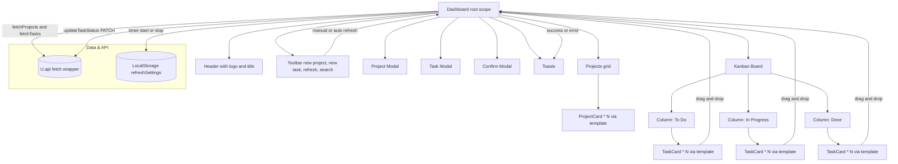

# CLAUDE.md

## Project Context

This is a demo web dashboard for booth use. The goals are a tiny, self contained source in one HTML file, fast readability for humans and AI, minimal DOM manipulation, and a simple opinionated design language. Everything runs off hotlinked CDNs. There is no build step.

The app includes:

* Project and task CRUD create, list, delete
* Drag and drop Kanban workflow
* Auto refresh with manual control
* Toast notifications instead of page banners
* Admin clear all

## Framework and Library Choices

### petite-vue

* Lightweight Vue subset that runs via CDN in a `<script type="module">`.
* Declarative reactivity with `v-scope`, `v-if`, `v-for`, `v-effect`, and computed getters on the scope object.
* Mounted once at `#app` with `createApp({ Dashboard, ProjectCard, TaskCard }).mount('#app')`.

### Feather Icons

* CDN `<script src="https://unpkg.com/feather-icons">` provides a global `feather`.
* Icons are declared with `data-feather="..."` and hydrated via `feather.replace()`.
* Re run after DOM changes via `v-effect` or `$nextTick`.

### Styling

* Hand rolled CSS in the same file with a small variable set under `:root`. No Pico.css. No utility framework.

No bundlers, no CLI, no preprocessors. The source is easy to audit and trivial to extend in a booth setting.

## Components and Structure

Subcomponents are petite-vue factories that return plain objects and are mounted with `v-scope`. Each points to a `<template>` via `$template`.

* BrandHeader inside the page header with logo, “Task Vantage”, a large gradient “Web”, and a subtitle.
* Toolbar with New Project, New Task, refresh menu manual or auto with interval, and search.
* ProjectList and ProjectCard template for the grid of projects with click to select and a delete icon.
* Board with three Columns To Do, In Progress, Done. Each renders TaskCard items and supports drop targets.
* TaskCard template with title, description, assignee avatar or initial, tags, due date, and a delete icon.
* Project modal, Task modal, Confirm modal implemented as custom divs toggled by a `.show` class.
* Toasts as a stacked container in the bottom right.

Interaction flow:

* A tiny API client performs fetches and parses JSON.
* Selecting a project triggers a task fetch for that project.
* Dragging pauses auto refresh. Dropping updates the task status with a PATCH call, then tasks are refetched.
* Loading states show simple text or empty placeholders. Toasts report success and error.

## CSS Design Motif

A small design system lives under `:root`:

* Brand tokens `--brand-a`, `--brand-b`, and `--brand-grad` for accent text and micro surfaces.
* Ink and neutral grays, panel colors and borders, shadows, semantic colors for ok, warn, danger.
* Cards, buttons, badges, avatars, counters, and layout primitives are styled directly.
* The service title block aligns a large gradient “Web” with the logo height via a simple grid.

Skeletons are not used. Loading text is used to avoid layout thrash.

## API Client

`U.api(base='/app/api')` wraps fetch, JSON parsing, and error unwrapping. It adds headers, handles 401 by redirecting to `/app`, and throws `Error` with a friendly message when possible.

Endpoints:

* `me`: `GET /me`
* `projects.list`: `GET /projects`
* `projects.create`: `POST /projects`
* `projects.remove`: `DELETE /projects/:id`
* `tasks.list`: `GET /tasks?projectId=...`
* `tasks.create`: `POST /tasks`
* `tasks.updateStatus`: `PATCH /tasks/:id/status` with `{ status }`
* `tasks.remove`: `DELETE /tasks/:id`
* `admin.clearAll`: `POST /admin/clear`

Everything that expects a body returns parsed JSON. Deletes and status updates use `expectJson=false` and return null on success.

## Key Technical Decisions

* Reusable UI pieces use petite-vue factories with `$template` pointing to `<template>` tags. This keeps markup in HTML and logic in JS while avoiding component registration.
* Cross scope interaction does not use `$parent`. Use `this.$root` if a child needs to call a root method.
* Icons use Feather, not Lucide. After any DOM change that touches icons, call `feather.replace()` within `v-effect` or `$nextTick`.
* Drag and drop uses native HTML5 DnD. Task id travels as `text/plain`. Columns manage `dragover`, `dragenter`, `dragleave`, and `drop`. Column level `.drop-hover` is the only highlight. The list level drop highlight is intentionally disabled.
* No optimistic dictionary. After updates, tasks are refetched for the selected project to avoid proxy and cache edge cases.
* The refresh system is explicit. A `U.timer` helper starts and stops an interval based on `autoEnabled`, `intervalMs`, and `isDragging`. Visibility changes stop and resume the timer to avoid background churn.
* Refresh settings persist in `localStorage` under `refreshSettings` as `{ enabled, intervalMs }`.

## Search and Filtering

* Projects are filtered by the query across `name` and `description`.
* Tasks are filtered by the same query across `title`, `description`, `ownerId`, and `tags`.
* Case insensitive substring match via small helpers in `U.text`.

## Modals and Toasts

* Project, Task, and Confirm modals are custom containers. Each toggles `.show` on the backdrop root and uses click outside and Escape to close where appropriate.
* Toasts live in an array with incremental ids. `toast(msg, kind)` pushes a toast and sets a 3500 ms auto dismiss. Kinds include `success` and `warning`. Icons are hydrated via `v-effect`.

## User and Avatars

* The header shows the signed in user’s avatar when available, otherwise an initial.
* A user type badge shows when `user.userType` is present, with a green gradient when `user.isB2BCustomer` is true.
* Task avatars show the signed in user’s picture only when `user.sub` matches the task `ownerId`. Otherwise a single letter initial derived from the id or email is shown.
* Owner labels are cleaned up for Auth0 style ids and emails, preferring a short name.

## How Auto Refresh Works

* The dropdown provides Manual or Auto, plus an interval selector 1 s, 5 s, 10 s, 30 s.
* The label shows Manual, Paused when dragging, or `Auto: Ns` when running.
* Dragging sets `isDragging` true and stops the timer. Ending drag restarts it if auto is enabled.
* `visibilitychange` stops the timer when hidden and restarts when visible.

## Common Pitfalls and What We Did

* Icons not rendering after list changes. Fix by calling `feather.replace()` in `v-effect` on the containers and after `$nextTick` in the root `@vue:mounted`.
* 401 from API calls. The API wrapper redirects to `/app` and returns a never resolving promise to halt further handling.
* Column dragleave flicker. `onDragLeave` checks `relatedTarget` and only clears the drop target when leaving the column entirely.
* Persistent loading state. `projects` starts as `null` to show a loading message, then becomes an array on success or failure so the loader clears.

## How to Extend

New components

```js
function MyWidget(props){ 
  return { 
    $template: '#my-widget-template',
    count: 0,
    inc(){ this.count++ }
  }
}
```

* Mount with `<div v-scope="MyWidget({ ... })"></div>`.
* For root interactions, call `this.$root.method()`.

API endpoints

* Extend `U.api` instead of writing ad hoc fetch calls.
* Use `await` with `try..catch`, and surface errors via `this.toast(e.message)`.

Styling and tokens

* Add or adjust variables in `:root`. Reuse tokens in class rules.
* Prefer token driven sizing and color over hardcoded values.

Icons

* Use Feather with `<i data-feather="plus"></i>`.
* Call `feather.replace()` after DOM mutation.

Toasts

* Prefer `this.toast('Saved', 'success')` over page banners.
* Keep messages short. Let auto dismiss handle most cases.

Accessibility

* Use semantic elements for headings, buttons, and inputs with labels.
* Use `aria` attributes where it improves clarity on dynamic regions.

## How to Run

* Open the HTML file in a modern browser. No client build is required.
* API calls hit `/app/api/...`. For offline demos, stub the API inside `U.api` or proxy a mock server on the same routes.

## Mermaid Overview



## Coding Conventions

* One file. `createApp({ Dashboard, ProjectCard, TaskCard }).mount('#app')` at the end.
* Factories and methods use lower camelCase to match petite-vue examples.
* Do not use `$parent`. Use `this.$root` for cross scope interactions.
* Use `v-effect` to run side effects like `feather.replace()` when lists render.
* Toasts auto dismiss unless the user closes them early.
